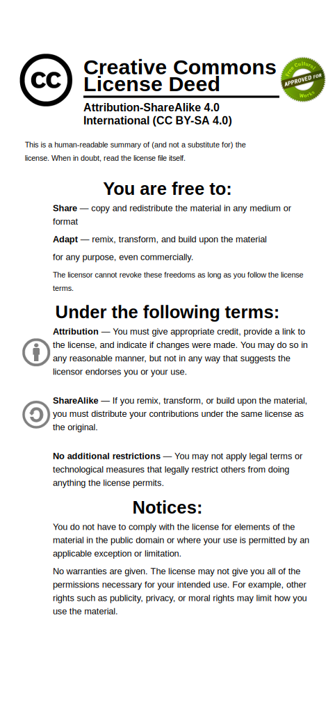

# The Four Freedoms of Free Software

* Art by LAV (@lilblucat — <https://twitter.com/lilblucat>)
* Typeset in the font MFEK Serif (<https://github.com/MFEK/MFEK-Serif.otf>) by Owen Earl (Indestructible Type LLC)
* This is free artwork! Licensed under the terms of the Creative Commons Attribution ShareAlike License 4.0.

# License
* (c) 2022 Modular Font Editor K Foundation, Inc. of Atlantic City, NJ
* **Required Attribution**: LAV (@lilblucat) & Fredrick R. Brennan for the Modular Font Editor K Foundation, Inc.

For full text, see file LICENSE.
